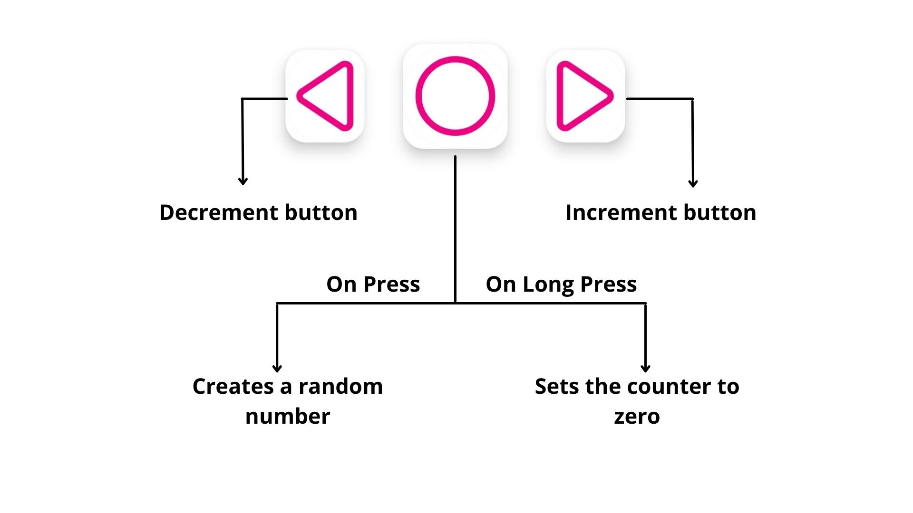

## Screenshots
---

<table>
    <tr>
        <td> 
             
            <h3 align="center">Light Mode</h3>
        </td>
        <td> 
             
            <h3 align="center">Dark Mode</h3>
        </td>
    </tr>
</table>

  

## How to use?
---

### To change mode
   ` Click on the number to switch between light and dark mode.`
  
## Design
---

**Designed using Figma.**

